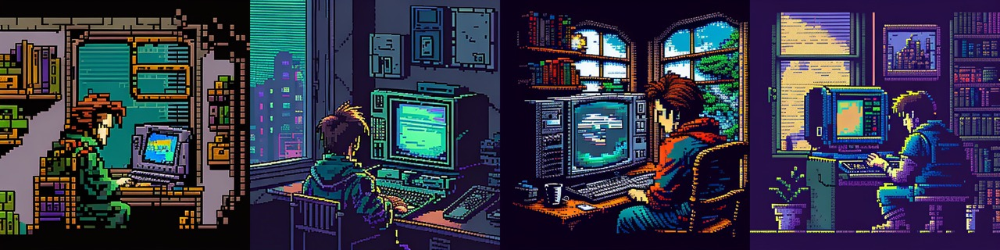

<h1 align="center">
  Hi there, I'm Viktor!
  
</h1>
<h3 align="center">
  I'm a QA engineer. And now I'm learning React.
</h3>

## About me
Hello eweryone, this is my introduction post! 👋🏻

I graduated from MEPhI (National Research Nuclear University) and worked as an engineer for 7 years in prominent companies like Rosatom, Criogaz, and Metrostroi.

During those years, I also had the opportunity to travel the world. I visited 20 countries, lived in Europe and America. I got to see the kind of life I aspired to. That's why, one day, I made the decision that I wasn't ready to spend my days working in a job that didn't offer me personal growth. I quit my job and started exploring the IT sector.

## My education
- `QA Testing` - by by Artsiom Rusau. 2023.

Stack:

- `Web development` - by Netology.ru. 2022 - now.

Stack:

